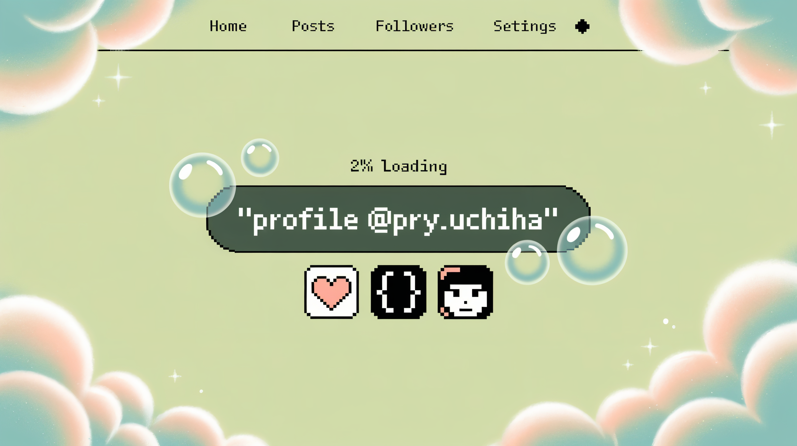

# ⛩ Konnichiwa! I'm Priyanshu (a.k.a Pry Uchiha)! 

Welcome to my GitHub profile! I'm a student from India that has recently embarked on my coding journey. Coding is rlly fun and I love to code. I learned coding from my teacher, Pawan Pookie🎀 and GitHub Copilot <3

  

---

> 💻 Full-time student | Part-time Web Warrior | Future Tech Ninja

*Training Arc:*
- Learning: HTML, CSS, JavaScript, Node.js, Machine Learning
- Mastering: Front-End & AI Skills with side quests in Open Source

*Current Missions:*
- Develop cool anime-themed projects
- Collaborate with senpais and fellow devs
- Level up coding skills, one bug at a time

*Stats:*
- Anime Fan ✅
- K-Drama Lover ✅
- Gamer (RPG & Strategy) ✅
- Hiker of 3 Mountains ✅

*Guild Contact:*
- Scrolls (Email): [priyanshubca24@hierank.org](mailto:priyanshubca24@hierank.org)

> “With code like chakra, I build the future one repo at a time.”

  
  

###

###

 <em><b>I love connecting with different people</b> so if you want to say <b>hi, I'll be happy to meet you more!</b> :)</em>

---

⭐️ From [@Priyanshu84iya](https://github.com/Priyanshu84iya)
