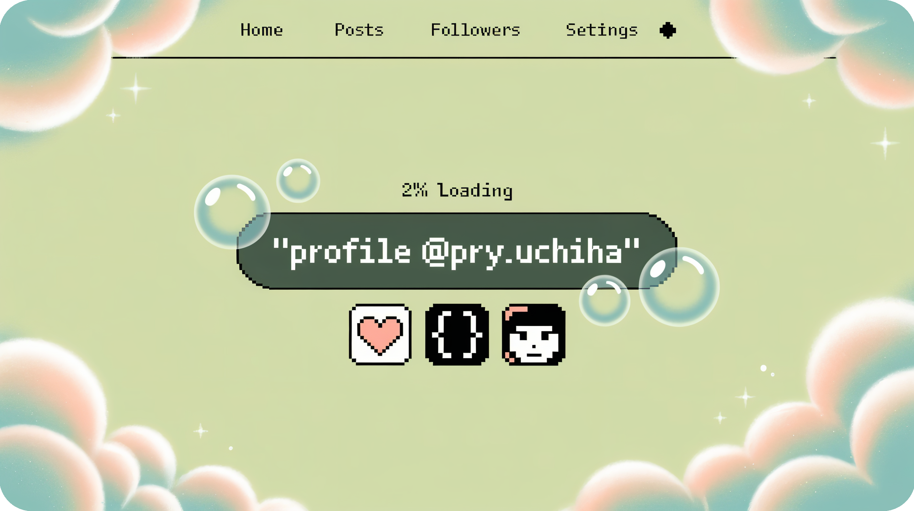

# ⛩ Konnichiwa! I'm Priyanshu (a.k.a Pry Uchiha)! 

 

  
### 🌟 Welcome to my coding dojo! 🌟

*I'm a student from India that has recently embarked on my coding journey. Coding is rlly fun and I love to code.*  
*I learned coding from my teacher, **Pawan Pookie**🎀 and **GitHub Copilot** <3*

  

 

## 🚀 About Me

<table align="center">
<tr>
<td align="center" width="50%">

### � Professional Journey
> �💻 **Full-time student** | **Part-time Web Warrior** | **Future Tech Ninja**

</td>
<td align="center" width="50%">

### 🎯 Current Focus
**Training Arc in Progress...**

</td>
</tr>
</table>

### 📚 Learning Path

<table align="center">
<tr>
<td align="center" width="33%">

#### 🌱 Currently Learning
- **HTML, CSS, JavaScript**
- **Node.js**
- **Machine Learning**

</td>
<td align="center" width="33%">

#### 🎯 Mastering
- **Front-End Skills**
- **AI Technologies**
- **Open Source Contributions**

</td>
<td align="center" width="33%">

#### 🚀 Current Missions
- **Anime-themed projects**
- **Collaborate with devs**
- **Level up coding skills**

</td>
</tr>
</table>

---

### 📊 My Stats & Achievements

| Category | Achievement |
|----------|------------|
| 🎌 **Anime Fan** | ✅ Certified Otaku |
| 🎮 **Gamer** | ✅ RPG & Strategy Master |
| 🏔️ **Adventure** | ✅ Conquered 3 Mountains |
| 💻 **Coding** | ✅ Bug Hunter in Training |

  

*Guild Contact:*
- Scrolls (Email): [priyanshubca24@hierank.org](mailto:priyanshubca24@hierank.org)

> “With code like chakra, I build the future one repo at a time.”

##  &nbsp;GitHub Statistics & Analytics

  

&nbsp;&nbsp;&nbsp;

  

  

 

---

##  &nbsp;Watch My Contributions Get Eaten

---

##  &nbsp;Let's Connect and Build Together

**I love connecting with different people** so if you want to say **hi, I'll be happy to meet you more!** 😊

  

### 🎌 Guild Contact Information

&nbsp;&nbsp;

  

📧 **Scrolls (Email):** [priyanshubca24@hierank.org](mailto:priyanshubca24@hierank.org)

 

### 💭 Philosophy

> *"With code like chakra, I build the future one repo at a time."*

  

### 🌟 Let's Code the Future Together 🌟

---

**⭐️ From [@Priyanshu84iya](https://github.com/Priyanshu84iya) with ❤️**

 

